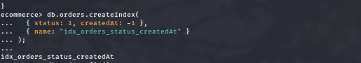

# DBS302 – Practical 3 Report
## Design and Implement an E-Commerce Platform Schema in MongoDB

**Student:** Pema Dolker   
**Student ID:** 02230294    
**Date:** April 23, 2026    
**Course:** DBS302    

---

## Table of Contents

1. [Aim](#1-aim)
2. [Objectives](#2-objectives)
3. [Tools and Software Used](#3-tools-and-software-used)
4. [Theory Overview](#4-theory-overview)
5. [Problem Statement](#5-problem-statement)
6. [Schema Design](#6-schema-design)
7. [Step-by-Step Implementation](#7-step-by-step-implementation)
8. [Aggregation Framework Queries](#8-aggregation-framework-queries)
9. [Query Performance Optimization](#9-query-performance-optimization)
10. [Results and Observations](#10-results-and-observations)
11. [Common Mistakes and How I Avoided Them](#11-common-mistakes-and-how-i-avoided-them)
12. [Conclusion](#12-conclusion)

---

## 1. Aim

To design and implement an e-commerce platform schema using MongoDB, write advanced queries with the aggregation framework, and apply indexing and query analysis techniques to optimize performance for real-world workloads.

---

## 2. Objectives

- Model a realistic e-commerce domain (users, products, orders, categories) using MongoDB's document-oriented data model.
- Insert sample data into the designed collections.
- Write aggregation pipelines for analytics: daily sales, top products, customer statistics.
- Create and tune indexes (compound, text) to support common query patterns.
- Use `explain()` to identify slow queries and verify the impact of optimizations.

---

## 3. Tools and Software Used

| Tool | Purpose |
|------|---------|
| MongoDB Community Server | Database engine |
| mongosh (MongoDB Shell) | Running all queries and pipelines |
| VS Code | Writing scripts and documentation |

### Starting MongoDB on Linux

```bash
# Start the MongoDB service
sudo systemctl start mongod

# Verify it is running
sudo systemctl status mongod

# Open the MongoDB shell
mongosh
```

---

## 4. Theory Overview

### MongoDB Data Modeling

MongoDB is a document-oriented NoSQL database that stores data as BSON (Binary JSON) documents. Unlike relational databases, MongoDB does not enforce a fixed schema, making it highly flexible for e-commerce product catalogs where different products can have different attributes.

**Key principles applied in this practical:**

- **Query-driven design:** The schema is shaped by the most frequent and performance-critical queries rather than normalization rules.
- **Embedding vs. Referencing:**
  - **Embed** data that is always read together and bounded in size (e.g., order items inside an order document).
  - **Reference** data that is shared across many documents or could grow without bound (e.g., product details referenced from orders by ID).
- **Attribute Pattern:** Used in the `products` collection to store variable key-value attributes (brand, color, battery life, etc.) in a flexible sub-document, since different product categories have different properties.

### Aggregation Framework

The MongoDB Aggregation Pipeline processes documents through a sequence of stages. Each stage's output becomes the next stage's input.

| Stage | Purpose |
|-------|---------|
| `$match` | Filters documents (like WHERE in SQL) |
| `$group` | Groups documents and computes aggregates (like GROUP BY) |
| `$project` | Reshapes documents, includes/excludes fields |
| `$sort` | Orders documents |
| `$limit` | Returns a fixed number of documents |
| `$unwind` | Deconstructs array fields into separate documents |
| `$lookup` | Performs a left outer join with another collection |

### Indexing and Query Optimization

Indexes allow MongoDB to find documents without scanning every document in a collection. Without indexes, MongoDB performs a **collection scan (COLLSCAN)** which is slow for large datasets.

**Index types used:**

- **Compound index** – Index on multiple fields; ordering follows the ESR rule.
- **Text index** – Enables full-text search across string fields.
- **Multikey index** – Automatically created when indexing array fields (e.g., `tags`).

**ESR Rule for compound indexes:**
1. Fields used in **equality** filters come first.
2. Fields used in **sort** come next.
3. Fields used in **range** queries come last.

---

## 5. Problem Statement

Design and implement a MongoDB schema for a simplified e-commerce platform that supports:

- Managing users and product catalogs with variable attributes.
- Recording customer orders with embedded order items.
- Running analytics queries: daily sales totals, top products by revenue, average order value per customer, and orders filtered by status and date range.
- Optimizing these queries using appropriate indexes and query analysis tools.

---

## 6. Schema Design

The e-commerce schema uses four collections:

```
ecommerce (database)
├── users        – Customer accounts
├── categories   – Product categories (hierarchical)
├── products     – Product catalog with flexible attributes
└── orders       – Customer orders with embedded items
```

### Design Decisions

| Relationship | Choice | Reason |
|---|---|---|
| Order → Order Items | **Embedded** | Items are always read with the order; bounded in size |
| Order → User | **Referenced** (userId) | Users exist independently; one user → many orders |
| Order → Product | **Referenced** (productId) | Products change; historical price duplicated in order item for accuracy |
| Product → Category | **Referenced** (categoryId) | One category → many products |

### Collection Schemas

#### users
```json
{
  "_id": ObjectId,
  "name": String,
  "email": String,
  "phone": String,
  "address": {
    "line1": String,
    "city": String,
    "country": String,
    "postalCode": String
  },
  "createdAt": Date
}
```

#### categories
```json
{
  "_id": ObjectId,
  "name": String,
  "slug": String,
  "parentCategoryId": ObjectId | null
}
```

#### products
```json
{
  "_id": ObjectId,
  "name": String,
  "slug": String,
  "categoryId": ObjectId,
  "price": Number,
  "currency": String,
  "stock": Number,
  "attributes": { ... },
  "tags": [String],
  "createdAt": Date
}
```

#### orders
```json
{
  "_id": ObjectId,
  "userId": ObjectId,
  "status": String,
  "items": [
    {
      "productId": ObjectId,
      "productName": String,
      "unitPrice": Number,
      "quantity": Number,
      "lineTotal": Number
    }
  ],
  "grandTotal": Number,
  "currency": String,
  "createdAt": Date,
  "paymentMethod": String
}
```

---

## 7. Step-by-Step Implementation

### 7.1 Create Database and Collections

```js
use ecommerce

db.createCollection("users")
db.createCollection("categories")
db.createCollection("products")
db.createCollection("orders")
```

**Expected output:** `{ ok: 1 }` for each collection.


---

### 7.2 Insert Sample Data

#### Insert Users

```js
db.users.insertMany([
  {
    name: "Tashi Dorji",
    email: "tashi@example.com",
    phone: "+975-17-123-456",
    address: {
      line1: "Building 12",
      city: "Thimphu",
      country: "Bhutan",
      postalCode: "11001"
    },
    createdAt: new Date("2026-04-18T08:00:00Z")
  },
  {
    name: "Sonam Choden",
    email: "sonam@example.com",
    phone: "+975-17-654-321",
    address: {
      line1: "Flat 3B",
      city: "Phuntsholing",
      country: "Bhutan",
      postalCode: "21001"
    },
    createdAt: new Date("2026-04-19T10:30:00Z")
  }
])
```


---

#### Insert Categories

```js
const electronicsId = new ObjectId()
const accessoriesId = new ObjectId()

db.categories.insertMany([
  { _id: electronicsId, name: "Electronics", slug: "electronics", parentCategoryId: null },
  { _id: accessoriesId, name: "Accessories", slug: "accessories", parentCategoryId: electronicsId }
])
```

---

#### Insert Products

```js
const headphonesId = new ObjectId()
const cableId = new ObjectId()
const keyboardId = new ObjectId()

db.products.insertMany([
  {
    _id: headphonesId,
    name: "Wireless Bluetooth Headphones",
    slug: "wireless-bluetooth-headphones",
    categoryId: electronicsId,
    price: 129.99,
    currency: "USD",
    stock: 200,
    attributes: { brand: "Acme Audio", color: "black", wireless: true, batteryLifeHours: 24 },
    tags: ["audio", "wireless", "headphones"],
    createdAt: new Date("2026-04-18T10:00:00Z")
  },
  {
    _id: cableId,
    name: "USB-C Cable 1m",
    slug: "usb-c-cable-1m",
    categoryId: accessoriesId,
    price: 9.99,
    currency: "USD",
    stock: 500,
    attributes: { brand: "Acme Tech", lengthMeters: 1, color: "white" },
    tags: ["cable", "usb-c"],
    createdAt: new Date("2026-04-18T11:00:00Z")
  },
  {
    _id: keyboardId,
    name: "Mechanical Keyboard",
    slug: "mechanical-keyboard",
    categoryId: electronicsId,
    price: 79.99,
    currency: "USD",
    stock: 150,
    attributes: { brand: "Acme Input", layout: "US", switchType: "blue", backlight: true },
    tags: ["keyboard", "mechanical", "backlit"],
    createdAt: new Date("2026-04-19T09:00:00Z")
  }
])
```


---

#### Insert Orders

```js
const tashi = db.users.findOne({ email: "tashi@example.com" })
const sonam = db.users.findOne({ email: "sonam@example.com" })

db.orders.insertMany([
  {
    userId: tashi._id,
    status: "PAID",
    items: [
      { productId: headphonesId, productName: "Wireless Bluetooth Headphones", unitPrice: 129.99, quantity: 2, lineTotal: 259.98 },
      { productId: cableId, productName: "USB-C Cable 1m", unitPrice: 9.99, quantity: 1, lineTotal: 9.99 }
    ],
    grandTotal: 269.97,
    currency: "USD",
    createdAt: new Date("2026-04-19T15:30:00Z"),
    paymentMethod: "CARD"
  },
  {
    userId: sonam._id,
    status: "PAID",
    items: [
      { productId: keyboardId, productName: "Mechanical Keyboard", unitPrice: 79.99, quantity: 1, lineTotal: 79.99 }
    ],
    grandTotal: 79.99,
    currency: "USD",
    createdAt: new Date("2026-04-20T09:15:00Z"),
    paymentMethod: "COD"
  }
])
```


---

## 8. Aggregation Framework Queries

### 8.1 Query 1 – Daily Sales Totals

**Goal:** Compute total revenue and order count per day for PAID orders.

```js
db.orders.aggregate([
  { $match: { status: "PAID" } },
  {
    $group: {
      _id: {
        year:  { $year: "$createdAt" },
        month: { $month: "$createdAt" },
        day:   { $dayOfMonth: "$createdAt" }
      },
      totalRevenue: { $sum: "$grandTotal" },
      orderCount:   { $sum: 1 }
    }
  },
  {
    $project: {
      _id: 0,
      date: { $dateFromParts: { year: "$_id.year", month: "$_id.month", day: "$_id.day" } },
      totalRevenue: 1,
      orderCount: 1
    }
  },
  { $sort: { date: 1 } }
])
```

**Pipeline explanation:**
- `$match` – Filters only PAID orders before grouping, reducing the data early.
- `$group` – Groups by year/month/day from `createdAt`; sums `grandTotal` and counts orders per day.
- `$project` – Reconstructs a clean date field and drops the internal `_id`.
- `$sort` – Returns results in chronological order.


---

### 8.2 Query 2 – Top Products by Revenue

**Goal:** Find the top 5 products by total revenue across all PAID orders.

```js
db.orders.aggregate([
  { $match: { status: "PAID" } },
  { $unwind: "$items" },
  {
    $group: {
      _id:           "$items.productId",
      productName:   { $first: "$items.productName" },
      totalRevenue:  { $sum: "$items.lineTotal" },
      totalQuantity: { $sum: "$items.quantity" }
    }
  },
  { $sort:  { totalRevenue: -1 } },
  { $limit: 5 }
])
```

**Pipeline explanation:**
- `$unwind` – Deconstructs the `items` array so each item becomes its own document for grouping.
- `$group` – Groups by `productId`; sums `lineTotal` and `quantity` per product.
- `$sort` – Orders by highest revenue first.
- `$limit` – Returns only the top 5.


---

### 8.3 Query 3 – Average Order Value per User

**Goal:** Compute spending statistics per user, with user names joined from the `users` collection.

```js
db.orders.aggregate([
  { $match: { status: "PAID" } },
  {
    $group: {
      _id:           "$userId",
      totalOrders:   { $sum: 1 },
      totalSpent:    { $sum: "$grandTotal" },
      minOrderValue: { $min: "$grandTotal" },
      maxOrderValue: { $max: "$grandTotal" },
      avgOrderValue: { $avg: "$grandTotal" }
    }
  },
  {
    $lookup: {
      from: "users", localField: "_id", foreignField: "_id", as: "user"
    }
  },
  { $unwind: "$user" },
  {
    $project: {
      _id: 0, userId: "$_id", userName: "$user.name",
      totalOrders: 1, totalSpent: 1,
      minOrderValue: 1, maxOrderValue: 1, avgOrderValue: 1
    }
  },
  { $sort: { totalSpent: -1 } }
])
```

**Pipeline explanation:**
- `$group` – Computes order count and spending statistics grouped by `userId`.
- `$lookup` – Joins with `users` collection to get the user's name (equivalent to a SQL JOIN).
- `$unwind` – Converts the `user` array returned by `$lookup` back into a single object.
- `$project` – Shapes the final output with meaningful field names.


---

### 8.4 Query 4 – Product Catalog with Category Name

**Goal:** List all products enriched with their category name using `$lookup`.

```js
db.products.aggregate([
  {
    $lookup: {
      from: "categories", localField: "categoryId", foreignField: "_id", as: "category"
    }
  },
  { $unwind: "$category" },
  {
    $project: {
      _id: 0, name: 1, price: 1,
      "attributes.brand": 1, "attributes.color": 1,
      categoryName: "$category.name"
    }
  },
  { $sort: { categoryName: 1, name: 1 } }
])
```


---

## 9. Query Performance Optimization

### 9.1 Indexes Created

#### Index 1 – Orders by User and Date

```js
db.orders.createIndex(
  { userId: 1, createdAt: -1 },
  { name: "idx_orders_user_createdAt" }
)
```

Supports: `db.orders.find({ userId: <id> }).sort({ createdAt: -1 })`

---

#### Index 2 – Orders by Status and Date (ESR Rule)

```js
db.orders.createIndex(
  { status: 1, createdAt: -1, grandTotal: 1 },
  { name: "idx_orders_status_createdAt_grandTotal" }
)
```

| ESR Field | Field | Role |
|-----------|-------|------|
| Equality | `status` | Exact match filter |
| Sort | `createdAt` | Sort direction |
| Range | `grandTotal` | Optional range filter |

---

#### Index 3 – Products by Category and Price

```js
db.products.createIndex(
  { categoryId: 1, price: 1 },
  { name: "idx_products_category_price" }
)
```

Supports: `db.products.find({ categoryId: <id> }).sort({ price: 1 })`

---

#### Index 4 – Text Search on Products

```js
db.products.createIndex(
  { name: "text", tags: "text" },
  { name: "idx_products_text", weights: { name: 10, tags: 5 } }
)
```

The `weights` option gives matches on `name` twice the relevance score of matches on `tags`.

**Example text search:**
```js
db.products.find(
  { $text: { $search: "wireless keyboard" } },
  { score: { $meta: "textScore" }, name: 1, price: 1 }
).sort({ score: { $meta: "textScore" } })
```


---

### 9.2 explain() Analysis – Before Index (COLLSCAN)

```js
db.orders.find(
  { status: "PAID", createdAt: { $gte: new Date("2026-04-19") } }
).sort({ createdAt: -1 }).explain("executionStats")
```

| Field | Value |
|-------|-------|
| `winningPlan.stage` | `COLLSCAN` |
| `totalDocsExamined` | 2 (all documents) |
| `totalKeysExamined` | 0 |

**Observation:** MongoDB scans every document in the collection because no suitable index exists. This is a full collection scan (COLLSCAN) — expensive and slow at scale.

<!--  -->

---

### 9.3 explain() Analysis – After Index (IXSCAN)

```js
db.orders.createIndex(
  { status: 1, createdAt: -1 },
  { name: "idx_orders_status_createdAt" }
)

db.orders.find(
  { status: "PAID", createdAt: { $gte: new Date("2026-04-19") } }
).sort({ createdAt: -1 }).explain("executionStats")
```

| Field | Value |
|-------|-------|
| `winningPlan.inputStage.stage` | `IXSCAN` |
| `totalDocsExamined` | Reduced |
| `totalKeysExamined` | Matches only |

**Observation:** With the index in place, MongoDB navigates the index tree directly to matching documents instead of scanning the whole collection, resulting in faster queries.



---

### 9.4 Extended Demo – Aggregation with Index-Friendly Pipeline

```js
db.orders.aggregate([
  {
    $match: {
      status: "PAID",
      createdAt: { $gte: new Date("2026-04-19") }
    }
  },
  { $sort: { createdAt: -1 } },
  {
    $project: {
      _id: 0, userId: 1, createdAt: 1, grandTotal: 1,
      itemCount: { $size: "$items" }
    }
  },
  { $limit: 20 }
])
```

When `$match` and `$sort` appear at the start of a pipeline and match an existing index (`{ status: 1, createdAt: -1 }`), MongoDB pushes them down to the query engine and uses the index — avoiding a collection scan even inside an aggregation pipeline.


---

## 10. Results and Observations

### Aggregation Results Summary

| Query | Result |
|-------|--------|
| Daily Sales | 2026-04-19: $269.97 (1 order); 2026-04-20: $79.99 (1 order) |
| Top Products | Headphones ($259.98) → Keyboard ($79.99) → Cable ($9.99) |
| Avg Order Value | Tashi Dorji: $269.97; Sonam Choden: $79.99 |
| Product Catalog | 3 products enriched with category name via `$lookup` |

### Index Performance Comparison

| Metric | Before Index (COLLSCAN) | After Index (IXSCAN) |
|--------|------------------------|----------------------|
| Query stage | COLLSCAN | IXSCAN |
| Documents examined | All documents in collection | Only matching documents |
| Keys examined | 0 | Equal to matched documents |
| Execution time | Higher | Lower |

Index creation significantly reduces documents examined. The performance gain grows as the collection size increases — with millions of documents, the difference between COLLSCAN and IXSCAN can be the difference between seconds and milliseconds.

---

## 11. Common Mistakes and How I Avoided Them

| Mistake | How I Avoided It |
|---------|-----------------|
| Schema designed like a relational database | Embedded order items in orders since they are always read together |
| Unbounded array growth | Order items are bounded per transaction; separate collections for open-ended data |
| Missing indexes on frequent queries | Created compound indexes for all major query patterns |
| Incorrect compound index field ordering | Followed ESR (Equality → Sort → Range) for all compound indexes |
| Over-indexing | Only indexed fields required by the most important query patterns |
| Assuming queries use indexes without verifying | Used `explain("executionStats")` to confirm IXSCAN before and after index creation |

---

## 12. Conclusion

This practical demonstrated the complete workflow for designing, implementing, and optimizing a MongoDB e-commerce schema.

**Schema Design** used a query-first approach. Embedding was chosen for order items (bounded and always read together) while referencing was used for users and products (shared entities with independent lifecycles). The Attribute Pattern in the `products` collection handles heterogeneous product specs cleanly without altering the collection schema per category.

**Aggregation Framework** — four multi-stage pipelines were built using `$match`, `$group`, `$project`, `$unwind`, `$lookup`, `$sort`, and `$limit`, producing daily sales totals, top product rankings, per-user spending stats, and an enriched product catalog.

**Indexing and Optimization** — four indexes were created. `explain("executionStats")` confirmed the transition from COLLSCAN to IXSCAN after index creation, proving the performance benefit.

MongoDB's flexible document model, powerful aggregation pipeline, and indexing system make it well-suited for e-commerce workloads that demand both flexible product catalogs and high-performance analytics.

---
